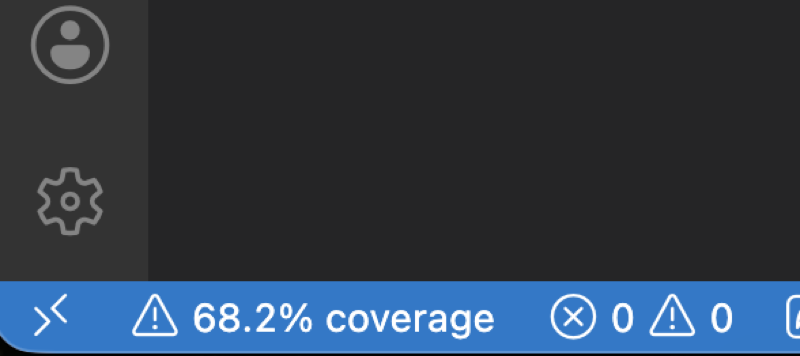
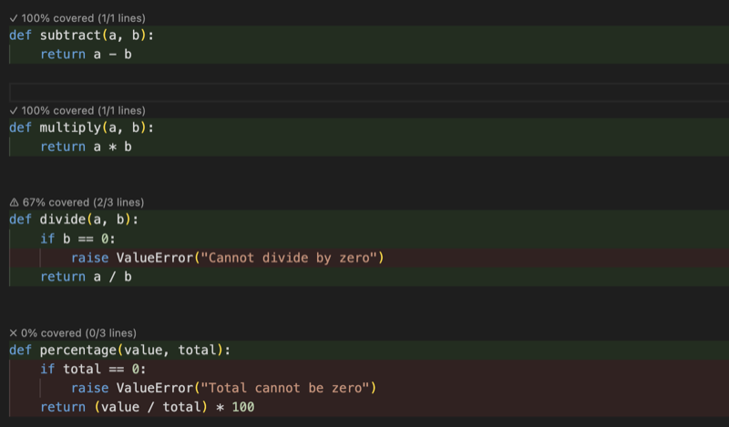
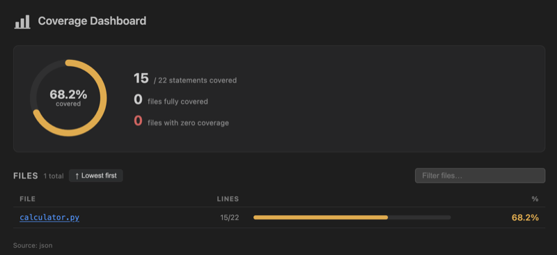
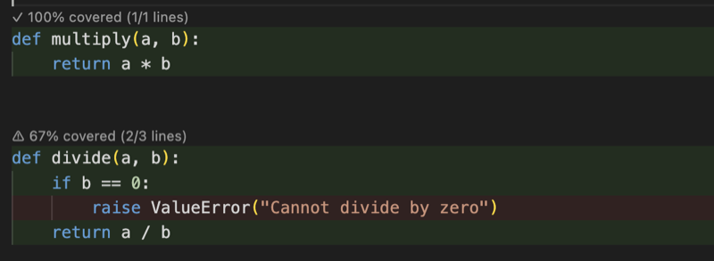
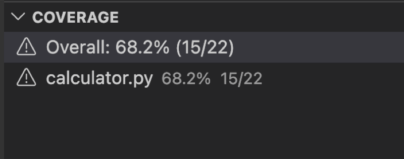
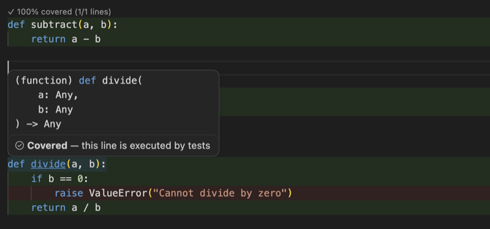
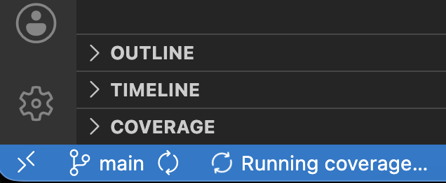

# Python Coverage Visualizer

> Know which lines your tests missed — without leaving the editor.

You run `pytest`. You get 73%. But 27% of what? Finding uncovered lines means opening a browser report, hunting for your file, and mentally mapping line numbers back to your code. Coverage Visualizer cuts all of that — green and red highlights appear inline, right where you write, the moment you run your tests.


---

## Features

**Auto-run on test save** — write a test, hit save, and pytest runs automatically in the background. No terminal, no command — the extension detects the file change, waits 2 seconds for you to finish typing, then kicks off a full coverage run. The status bar shows a spinner while it runs so you always know something is happening. Turn it off via `autoRunOnTestChange` if your suite is too slow to run on every save.



**Inline highlights** — covered lines get a green background, missed lines get red, and overview ruler markers appear along the right edge so you can spot gaps in a file without scrolling a single line. Open any Python file after running coverage and the highlights are already there.



**Interactive dashboard** — a full coverage report inside VS Code, no browser needed. The ring chart shows your overall percentage at a glance; the file table lists every file sorted by coverage with a progress bar per row. Click any filename and the editor jumps straight to that file.



**CodeLens** — a coverage percentage appears above every `def` and `class` as you work, updated live whenever coverage changes. At a glance you can see which functions are well-tested and which are being ignored, without opening any report.



**Sidebar tree view** — the Coverage panel in the Explorer sidebar stays open as you work and shows every file with a green check, yellow warning, or red cross depending on your configured thresholds. No need to open the dashboard to know where you stand.



**Hover tooltips** — hover any highlighted line and a tooltip confirms whether that exact line is covered or not. Useful when you want to verify that a specific branch or edge case was actually exercised by your tests.



**Status bar** — your overall coverage percentage sits in the bottom status bar at all times. Click it to open the dashboard. When a coverage run is in progress the percentage is replaced with a spinner so you know it's updating.



---

## Supported Formats

| Format          | How to generate                             |
| --------------- | ------------------------------------------- |
| `coverage.json` | `pytest --cov=. --cov-report=json`          |
| `coverage.xml`  | `pytest --cov=. --cov-report=xml`           |
| `.coverage`     | `pytest --cov=.` (raw SQLite, no JSON step) |

No Python runtime required — the extension reads all three formats natively.

---

## Installation

Search for **Python Coverage Visualizer** in the Extensions panel (`Cmd+Shift+X` / `Ctrl+Shift+X`) and click Install.

---

## Quick Start

1. Install pytest-cov in your Python project:

   ```bash
   pip install pytest-cov
   ```

2. Open the Command Palette (`Cmd+Shift+P` / `Ctrl+Shift+P`) and run **Coverage Visualizer: Show Coverage**. The extension runs pytest and generates coverage automatically.

3. Green and red highlights appear across all open Python files immediately.

From this point, save any test file and coverage updates on its own — no command needed.

---

## Commands

| Command                               | What it does                                     |
| ------------------------------------- | ------------------------------------------------ |
| `Coverage Visualizer: Show Coverage`  | Load coverage and apply highlights to open files |
| `Coverage Visualizer: Show Dashboard` | Open the interactive coverage dashboard          |
| `Coverage Visualizer: Clear Coverage` | Remove all highlights and reset state            |

---

## Configuration

Open **Settings** (`Cmd+,`) and search for **Coverage Visualizer**, or add to `settings.json`:

| Setting                                      | Default                   | Description                                                                           |
| -------------------------------------------- | ------------------------- | ------------------------------------------------------------------------------------- |
| `coverageVisualizer.autoRunOnTestChange`     | `true`                    | Re-run pytest automatically when a test file is saved                                 |
| `coverageVisualizer.autoReloadOnChange`      | `true`                    | Auto-reload decorations when coverage files change on disk                            |
| `coverageVisualizer.thresholdGood`           | `80`                      | % at or above which a file shows green in the sidebar                                 |
| `coverageVisualizer.thresholdWarn`           | `50`                      | % at or above which a file shows yellow (below → red)                                 |
| `coverageVisualizer.excludeTestFiles`        | `true`                    | Skip highlights and CodeLens on test files (`test_*.py`, `*_test.py`, `tests/` dirs) |
| `coverageVisualizer.enableCodeLens`          | `true`                    | Show coverage % above `def` / `class` definitions                                     |
| `coverageVisualizer.enableHoverMessages`     | `true`                    | Show covered / not-covered tooltip on hover                                           |
| `coverageVisualizer.coveredHighlightColor`   | `rgba(0, 180, 0, 0.10)`   | Background color for covered lines                                                    |
| `coverageVisualizer.uncoveredHighlightColor` | `rgba(220, 50, 50, 0.10)` | Background color for uncovered lines                                                  |
